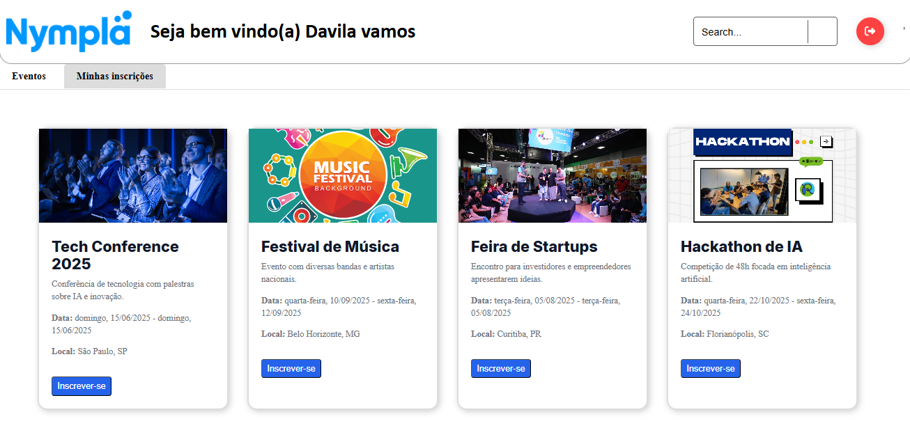
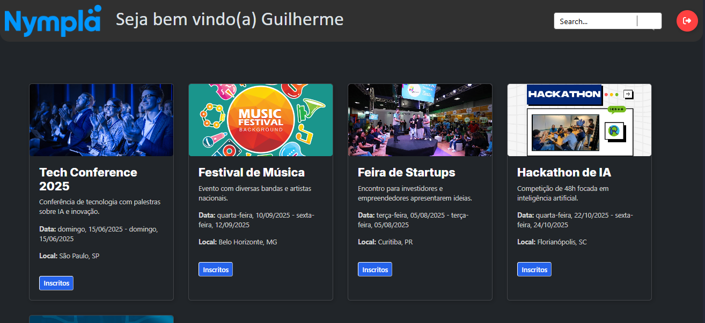

# Projeto de Estudo Nympla

Projeto desenvolvido na disciplina de programação web II teve como objetivo criar um site que gerencie eventos, possuindo funcionalidades como usuario normal a inscrição de eventos e a consulta de eventos ja inscritos e como admin podendo criar, atualizar e deletar eventos.

## Tecnologias Utilizadas

- Node.js
- Express
- PostgreSQL
- javascript
- HTML
- CSS

## Funcionalidades

- Inscrever-se em um evento
- Consultar eventos ja inscritos
- Criar, atualizar e deletar eventos

## imagens do projeto
Tela de login

Tela de profile

Tela de admin

